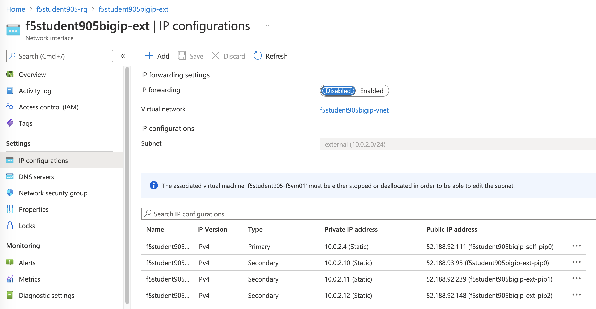
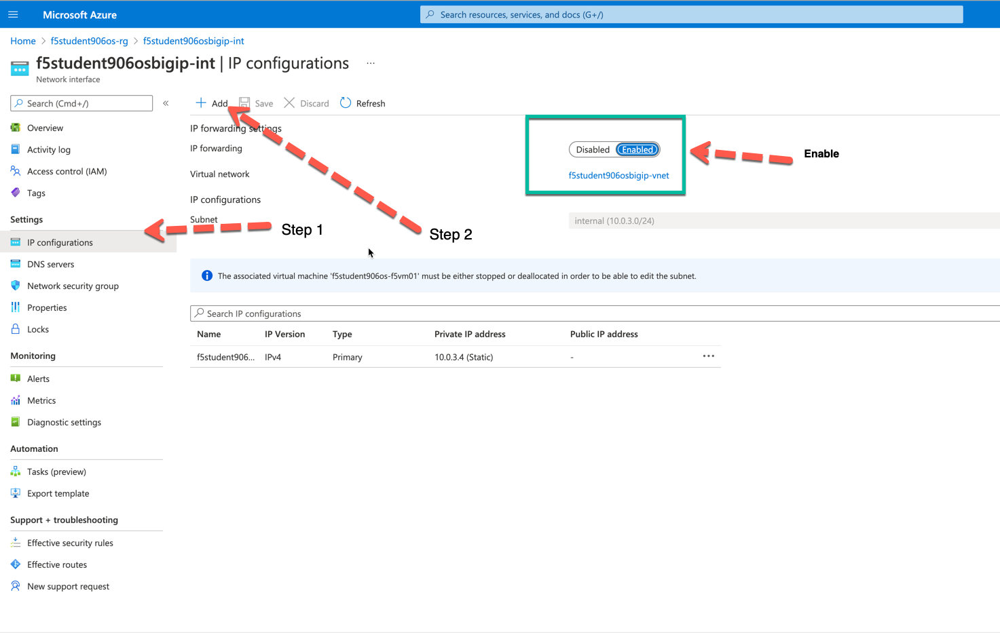
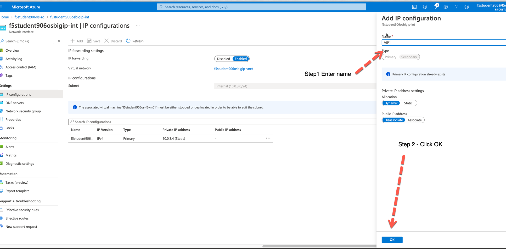
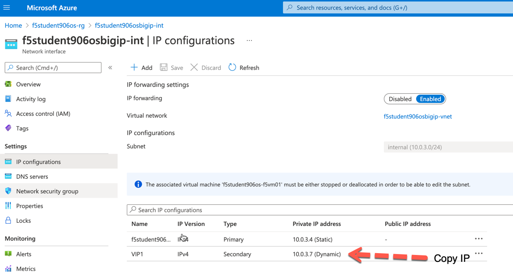

Configure BIG-IP Base Configuration
===================================

In this module of the lab, we will be configuring the BIG-IP Advanced Firewall Manager (AFM) with the initial network configuration. Additionally, we will configure the AFM with NAT policies to allow the internal application servers to communicate to the Internet.

BIG-IP Network Addressing
^^^^^^^^^^^^^^^^^^^^^^^^^
.. list-table::
    :widths: 20 20 20 20 20
    :header-rows: 1
    :stub-columns: 0

    * - **Name**
      - **BIG-IP Interface**
      - **Azure Interface**
      - **IP Address**
      - **Note**
    * - EXTERNAL SELF PRIVATE
      - self_2nic
      - f5vm01-self (Primary)
      - 10.0.2.4
      - local source for IPSEC
    * - EXTERNAL SELF PUBLIC
      - self_2nic
      - 5vm01-self (Primary)
      - 
      - used as IPSEC ID
    * - OUTBOUND-IP PAT PRIVATE
      - none
      - ext-ipconfig0
      - 10.0.2.10
      - Egress NAT (Overload) in AFM
    * - OUTBOUND-IP PAT PUBLIC
      - none
      - ext-ipconfig0
      - 
      - source IP egressing Azure
    * - INBOUND-IP PAT PRIVATE
      - none
      - ext-ipconfig1
      - 10.0.2.11
      - ingress NAT (PAT) in AFM
    * - INBOUND-IP PAT PUBLIC
      - none
      - ext-ipconfig1
      - 
      - ingress destination IP in Azure
    * - INTERNAL SELF
      - self_3nic
      - f5vm01-ipconfig1
      - 10.0.3.4
      - local source for IPSEC
    * - INTERNAL SELF
      - self_3nic
      - f5vm01-ipconfig1
      - 10.0.3.7
      - local source for IPSEC
    * - App1
      - none
      - app1-ipconfig1 (Primary)
      - 10.0.2.5
      - NAT target and pool (VPN)
    * - App2
      - none
      - app2-ipconfig1 (Primary)
      - 10.0.2.6
      - NAT target and pool (VPN)

- Browse to bigip-ext->ip config to capture BIG-IP Networking info, enable ip forwarding

- Browse to bigip-int->ip config to capture BIG-IP Networking info, enable ip forwarding

- Add Secondary IP

#. Connect to BIG-IP TMOS CLI
    - ssh azureuser@<f5student#bigip-mgmt-pip>
    - password: ChangeMeNow123!

#. Configure SELF IP's to allow for VPN termination

    .. code-block:: shell

        modify net self self_2nic allow-service replace-all-with { 50:0 udp:500 udp:4500 }
        modify net self self_3nic allow-service none

#. Configure DB keys to allow Azure link local DNS and IP VPN termination

    .. code-block:: shell

        modify sys db config.allow.rfc3927 { value "enable" }
        modify sys db ipsec.if.checkpolicy { value "disable" }
        modify sys db connection.vlankeyed { value "disable" }

#. Configure local DNS cache for the F5 Firewall by getting the internal Self IP address from the table above. Replace  <INTERNAL SELF> with the IP below where indicated.

    .. image:: ./images/selfip.png
    

    
    .. code-block:: shell

        create ltm dns cache resolver DNS_CACHE route-domain 0
    
    .. code-block:: shell

        create ltm profile dns DNS_CACHE { cache DNS_CACHE enable-cache yes enable-dns-express no enable-gtm no use-local-bind no }

    .. code-block:: shell

        create ltm pool AZURE_VNET_DNS { members replace-all-with { 168.63.129.16:53 } monitor tcp_half_open }

    .. code-block:: shell
        
        create ltm virtual DNS_CACHE_TCP { destination <INTERNAL SELF>:53 ip-protocol tcp pool AZURE_VNET_DNS profiles replace-all-with { f5-tcp-progressive {} DNS_CACHE {} } vlans-enabled vlans replace-all-with { internal } }
        
    .. code-block:: shell

        create ltm virtual DNS_CACHE_UDP { destination <INTERNAL SELF>:53 ip-protocol udp pool AZURE_VNET_DNS profiles replace-all-with { udp {} DNS_CACHE {} } vlans-enabled vlans replace-all-with { internal } }
    
    .. code-block:: shell
        
        create net dns-resolver LOCAL_CACHE { answer-default-zones yes forward-zones replace-all-with { . { nameservers replace-all-with { <INTERNAL SELF>:53 } } } }

    
    
    
  Confirm these two virtual servers we created on the firewall.

    .. image:: ./images/dnscache.png

#. Configure FQDN resolution of AFM against Azure VNET DNS, Configure AFM local logging, etc.

    .. code-block:: shell

        modify security firewall global-fqdn-policy { dns-resolver LOCAL_CACHE }

#. GLOBAL LOGS : Set the global logging profile
      
    .. code-block:: shell
    
        modify security log profile global-network nat { end-inbound-session enabled end-outbound-session { action enabled elements replace-all-with { destination } } errors enabled log-publisher local-db-publisher log-subscriber-id enabled quota-exceeded enabled start-inbound-session enabled start-outbound-session { action enabled elements replace-all-with { destination } } } network replace-all-with { global-network { filter { log-acl-match-accept enabled log-acl-match-drop enabled log-acl-match-reject enabled log-geo-always enabled log-tcp-errors enabled log-tcp-events enabled log-translation-fields enabled log-uuid-field enabled log-ip-errors enabled log-acl-to-box-deny enabled log-user-always enabled } publisher local-db-publisher } }

    
  Verify the changes were made to the profile
    
    .. code-block:: shell

        list security log profile global-network
    
    
    
    Your configuration should match the image below.

    .. image:: ./images/globalnetwork.png

#. Logging Profile :
    
    Create a new logging profile called AFM-LOCAL

    .. code-block:: shell

        create security log profile AFM-LOCAL { nat { end-inbound-session enabled end-outbound-session { action enabled elements replace-all-with { destination } } errors enabled log-publisher local-db-publisher log-subscriber-id enabled quota-exceeded enabled start-inbound-session enabled start-outbound-session { action enabled elements replace-all-with { destination } } } network replace-all-with { global-network { filter { log-acl-match-accept enabled log-acl-match-drop enabled log-acl-match-reject enabled log-geo-always enabled log-tcp-errors enabled log-tcp-events enabled log-translation-fields enabled log-uuid-field enabled log-ip-errors enabled log-acl-to-box-deny enabled log-user-always enabled } publisher local-db-publisher } } }

    
    View the changed profile

    .. code-block:: shell 
    
     list security log profile AFM-LOCAL

            
    
    - Your output should look like the image below.

    .. image:: ./images/loggingprofile.png

#. Configure MGMT Port AFM Rules.  This will allow SSH and HTTPS to the MGMT address and deny everything else.

    .. code-block:: shell

        modify security firewall management-ip-rules { rules replace-all-with { ALLOW-SSH { action accept place-before first ip-protocol tcp log yes description "Example SSH" destination { ports replace-all-with { 22 } } } ALLOW-HTTPS { action accept description "Example HTTPS" ip-protocol tcp log yes destination { ports replace-all-with { 443 } } } DENY-ALL { action drop log yes place-after last } } }

#. Switch the F5 from ADC mode into Firewall mode

    .. code-block:: shell

        modify sys db tm.fw.defaultaction value drop

#. Configure basic AFM Policies and NAT Policies for initial outbound PAT via a single additional IP on the instance
    
    - You will need the 1st additional "External" IP for the instace here.  Please remember you need to use the private Azure IP and not the Public IP that get's nat'd to the instance via Azure. Get the ip from the table above.

    - The image below will show you where to find the IPs in addition to the table at the beginning

    .. image:: ./images/pipaddresses.png

    - Replace <ADDITIONAL PUBLIC IP FOR PAT> with the appropriate address

   
   
    .. code-block:: shell

        create security nat source-translation OUTBOUND-PAT addresses add { <ADDITIONAL PUBLIC IP FOR PAT>/32 } pat-mode napt type dynamic-pat ports add { 1024-65535 }
        
    .. code-block:: shell   
        
        create security nat policy OUTBOUND-PAT rules replace-all-with { RFC-1918-OUTBOUND-PAT { source { addresses add { 10.0.0.0/8 172.16.0.0/12 192.168.0.0/16 } } translation { source OUTBOUND-PAT } } }
        
    .. code-block:: shell   
    
        create security firewall policy PUBLIC-SELF rules replace-all-with { ALLOW-ESP { ip-protocol esp action accept } ALLOW-IKE { ip-protocol udp destination { ports add { 500 } } action accept } ALLOW-NAT-T { ip-protocol udp destination { ports add { 4500 } } action accept } }
        
    .. code-block:: shell  
        
        create security firewall policy OUTBOUND-FORWARDING rules replace-all-with { OUTBOUND-ALLOW { action accept log yes source { addresses add { 10.0.0.0/8 172.16.0.0/12 192.168.0.0/16 } } source { vlans replace-all-with { internal } } } }
        
    .. code-block:: shell   
        
        create security firewall policy DNS_CACHE { rules replace-all-with { ALLOW-DNS-UDP { action accept ip-protocol udp log yes place-before first destination { ports replace-all-with { 53 } } source { addresses replace-all-with { 10.0.0.0/8 172.16.0.0/12 192.168.0.0/16 } vlans replace-all-with { internal } } } ALLOW-DNS-TCP { action accept ip-protocol tcp log yes destination { ports replace-all-with { 53 } } source { addresses replace-all-with { 10.0.0.0/8 172.16.0.0/12 192.168.0.0/16 } vlans replace-all-with { internal } } } } }

#. Attach AFM Policies to Self IP's

    .. code-block:: shell

        modify net self self_2nic fw-enforced-policy PUBLIC-SELF
        
#. Attach AFM Policy to DNS Cache VIP

    .. code-block:: shell
    
        modify ltm virtual DNS_CACHE_UDP fw-enforced-policy DNS_CACHE security-log-profiles add { AFM-LOCAL }
        modify ltm virtual DNS_CACHE_TCP fw-enforced-policy DNS_CACHE security-log-profiles add { AFM-LOCAL }

#. Configure forwarding virtual servers for outbound traffic and attach AFM Policies/NAT Policies where applicable

    .. code-block:: shell

        create ltm virtual VS-FORWARDING-OUTBOUND destination 0.0.0.0:any ip-forward vlans replace-all-with { internal } vlans-enabled profiles replace-all-with { fastL4 } fw-enforced-policy OUTBOUND-FORWARDING security-nat-policy { policy OUTBOUND-PAT } security-log-profiles add { AFM-LOCAL }

#. Change Azure VNET routing, enable forwarding, etc and test basic configuration.

    - You will create an UDR (user defined route) 0.0.0.0/0 to the AFM Internal Self IP, then you will test the configuration with Ping from both App servers.

    .. image:: ./images/azureroute0.png

    .. image:: ./images/azureroute0.png

    .. image:: ./images/azureroute0.png

    .. image:: ./images/azureroute0.png

    .. image:: ./images/azureroute1.png

    .. image:: ./images/azureroute4.png

    .. image:: ./images/azureroute5.png
    
    .. image:: ./images/azureroute6.png

Demonstrate Egress filtering
~~~~~~~~~~~~~~~~~~~~~~~~~~~~

#. Modify the AFM to block outbound access

    .. code-block:: shell

        modify security firewall policy OUTBOUND-FORWARDING rules none

#. You will confirm outbound access is now blocked from each the APP servers.  You need to serial console into the app servers to ping from them. Screenshots and details below.

    - From the Resource Group pick either app1 or app2

    .. image:: ./images/console2.png

    - In the left pane, select Serial Console, if the image is like below you need to enable Boot Diagnostics

    .. image:: ./images/console4.png

    - Select Boot Diagnostics

    .. image:: ./images/console5.png

    - Then select the storage account for your Resource Group

    .. image:: ./images/console6.png

    - Back to Serial Console

    .. image:: ./images/console7.png

    .. image:: ./images/console8.png

    - Now test the blocking configuration

    .. code-block:: shell

        ping -c 3 google.com
        ping -c 3 1.1.1.1

    .. image:: ./images/pinggoogle.png
    

    - This should result in 100% packet loss

#. Whitelist specific hosts/ports/protocols/FQDN's (i.e. allow 80/443 to google.com and ICMP to CloudFlare DNS)

    .. code-block:: shell

        modify security firewall policy OUTBOUND-FORWARDING rules add { ALLOW-GOOGLE.COM { ip-protocol tcp source { addresses add { 10.0.0.0/8 172.16.0.0/12 192.168.0.0/16 } vlans add { internal } } destination { fqdns add { google.com www.google.com } ports add { 80 443 } } place-after first action accept log yes } }
        modify security firewall policy OUTBOUND-FORWARDING rules add { ALLOW-CF-ICMP { ip-protocol icmp source { addresses add { 10.0.0.0/8 172.16.0.0/12 192.168.0.0/16 } vlans add { internal } } destination { addresses add { 1.1.1.1 1.0.0.1 } } place-after first action accept log yes } }
        

    - Retest the configuration and you now should be able to ping.

    .. code-block:: shell

        ping -c google.com
        ping -c 1.1.1.1

    .. image:: ./images/pingcloudflare.png

#. Configure Server to use DNS Caching VIP 
    
    - You will need the internal IP of the AFM and to be SSH'd into both app servers.  On each App server update the systemd-resolved.conf to leverate our F5 DNS cache so that AFM FQDN resolution works correctly. 
    
    .. code-block:: shell
    
        sudo su -c 'echo "DNS=10.0.3.4" >> /etc/systemd/resolved.conf && systemctl restart systemd-resolved.service'  
       

#. Confirm whitelisting works as expected by testing from the APP servers , show logs in AFM gui to confirm 

    .. code-block:: shell

        nc -v google.com 80
        nc -v google.com 443
        ping 1.1.1.1
        ping 1.0.0.1

Demonstrate Ingress NAT via AFM
~~~~~~~~~~~~~~~~~~~~~~~~~~~~~~~

#. Ensure that the Public Interface NSG of the F5 Instance has a firewall rule allowing all ports and protocols.

    .. image:: ./images/forward1.png
    .. image:: ./images/forward2.png
    .. image:: ./images/forward3.png
    .. image:: ./images/forward4.png
    .. image:: ./images/forward5.png

#. Configure inbound port mappings for SSH to both App servers (i.e. TCP/2022 to App1, TCP/2023 to App2)

    .. code-block:: shell

        create security nat destination-translation APP1-SSH { addresses replace-all-with { <APP-1 IP> { } } ports replace-all-with { 22 } type static-pat }
        create security nat destination-translation APP2-SSH { addresses replace-all-with { <APP-2 IP> { } } ports replace-all-with { 22 } type static-pat }
        
        create security nat policy INBOUND-PAT { rules replace-all-with { APP1-SSH { destination { addresses replace-all-with { <PUBLIC INTERFACE IP FOR INBOUND PAT>/32 { } } ports replace-all-with { 2022 } } ip-protocol tcp log-profile AFM-LOCAL source { vlans replace-all-with { external } } translation { destination APP1-SSH } } APP2-SSH { destination { addresses replace-all-with { <PUBLIC INTERFACE IP FOR INBOUND PAT>/32 { } } ports replace-all-with { 2023 } } ip-protocol tcp log-profile AFM-LOCAL source { vlans replace-all-with { external } } translation { destination APP2-SSH } } } }

#. Configure matching AFM firewall rules to allow traffic through the NAT and create inbound forwarding VS

    .. code-block:: shell

        create security firewall policy INBOUND-PAT { rules replace-all-with { ALLOW-APP1-SSH { action accept ip-protocol tcp log yes destination { addresses replace-all-with { <PUBLIC INTERFACE IP FOR INBOUND PAT>/32 } ports replace-all-with { 2022 } } source { vlans replace-all-with { external } } } ALLOW-APP2-SSH { action accept ip-protocol tcp log yes destination { addresses replace-all-with { <PUBLIC INTERFACE IP FOR INBOUND PAT>/32 } ports replace-all-with { 2023 } } source { vlans replace-all-with { external } } } } }
        create ltm virtual VS-FORWARDING-INBOUND { destination 0.0.0.0:any mask any ip-forward fw-enforced-policy INBOUND-PAT profiles replace-all-with { fastL4 } security-nat-policy { policy INBOUND-PAT } vlans-enabled vlans replace-all-with { external } }

#. Validate configuration from outside of the F5, show logs on AFM

    .. code-block:: shell

        nc -v <Public IP for inbound pat> 2022
        nc -v <Public IP for inbound pat> 2023
        ssh -p 2022 azureuser@<public ip>
        ssh -p 2023 azureuser@<public ip>
